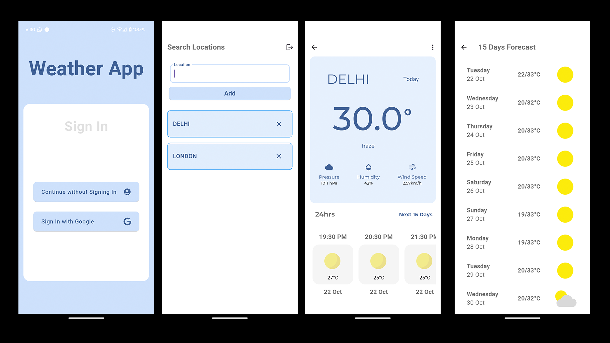

# 🌤️ Weather App

Welcome to the **Weather App**! This Flutter application empowers users to input their desired location and fetch real-time weather information effortlessly. Whether you want to check today’s forecast or plan for the next two weeks, this app has you covered!

## 🚀 Features

- **🌍 Location Input**: Easily enter any city or location to retrieve its weather data.
- **⏰ 24-Hour Weather Forecast**: Get detailed weather insights for the upcoming 24 hours, including temperature, humidity, wind speed, and more.
- **📅 15-Day Weather Forecast**: Access a comprehensive 15-day weather outlook to help you plan ahead.
- **☁️ Firebase Integration**: All added locations are securely saved using Firebase, ensuring your favorite places are preserved for future access.
- **🔑 User Authentication**: Seamlessly sign in with your Google account or choose to continue anonymously.

## 🛠️ Getting Started

Follow these steps to get a local copy up and running on your machine:

### 1. Clone the repository

```bash
git clone https://github.com/Udbhav2105/weather_app.git
```

### 2. Navigate to the project directory

```bash
cd weather_app
```

### 3. Install dependencies

Ensure you have Flutter installed. Run:

```bash
flutter pub get
```

### 4. Run the app

Launch the app with:

```bash
flutter run
```
## OR

## 📱 Download APK

You can download the latest APK release from the following link:
[WeatherApp APK](https://github.com/Udbhav2105/weather_app/releases/tag/WeatherApp_APk)

---


## Click here to see demo of this application [Demo Video](lib/images/demo-video.mp4)

## 📖 Usage

1. **User Authentication**: Choose to sign in with your Google account or continue as a guest.
2. **Input Location**: Enter your desired location in the search bar.
3. **Fetch Weather**: After entering the location, view the current weather data, a 24-hour forecast, and a 15-day forecast.



## 💻 Technologies Used

- **Flutter**: Build beautiful and natively compiled applications for mobile.
- **Firebase**: Utilize Firestore for efficient data storage.
- **OpenWeather API**: Access reliable weather data.
- **Weatherbit API**: Get detailed extended forecasts.

## 📱 Download APK

You can download the latest APK release from the following link:

[WeatherApp APK](https://github.com/Udbhav2105/weather_app/releases/tag/WeatherApp_APk)

## 🤝 Contributing

Contributions are welcome! If you have suggestions for improvements or new features, feel free to fork the repository and submit a pull request.
